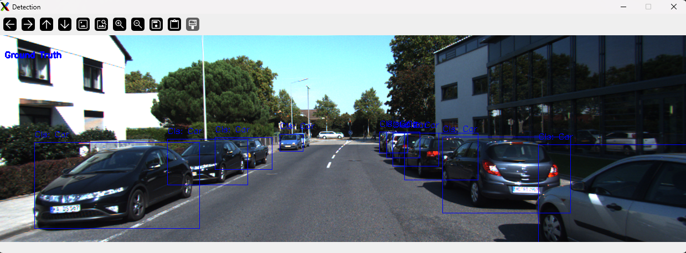
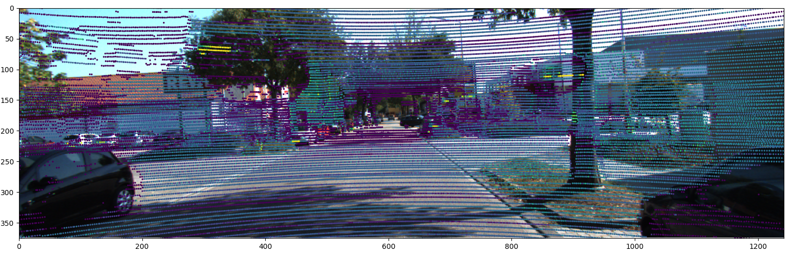

# Overview
This repository containing the scripts for KITTI dataset analysis:
- KITTI loader class for parsing data
- Interactive Visualization tool

## TODOs
- [ ] Implement pcd visualization
- [x] Function for saving files in output dir

### Preview of data

Cam_02 and Bounding boxes          |  Camera and LiDAR fusion
:-------------------------:|:-------------------------:
  |  

## Setup and Usage
1. Setup the environment
```
# Clone the repo
git clone git@github.com:gaurav00700/KITTIDatasetAnalysis.git
cd KITTIDatasetAnalysis

#Create the Python environment
conda create -n kittianalysis python=3.9 -y

conda activate kittianalysis
pip install --upgrade pip

#Install using requirements
pip install -r requirements.txt
```

2. Download dataset from [KITTI website](https://www.cvlibs.net/datasets/kitti/raw_data.php) and organize folder as shown below
```
├── kitti 
│  ├── 2011_09_26
│  │  ├── 2011_09_26_calib
│  │  ├── 2011_09_26_0008_sync (synced+rectified)
│  │  │  ├── image_00
│  │  │  ├── image_01
│  │  │  ├── image_02
│  │  │  ├── image_03
│  │  │  ├── oxts
│  │  │  ├── velodyne_points
│  │  ├── 2011_09_26_0008_tracklets
│  │  │  ├── tracklet_labels.xml
```
3. Run the script [KITTI](scripts/kitti_dataset_analysis.py)
```
python scripts/kitti_dataset_analysis.py
```


## Folder structure

```
├── data (contains input and output files)
│ ├── input (files required for scripts)
│ ├── output(Folders for respective script output)  
├── lib (contains modules python files)
│ ├── kitti_loader.py
│ ├── tools.py
│ ├── utils.py 
│ ├── visualization.py
├── scripts (contains main script python files)  
│ ├── kitti_dataset_analysis.py
├── src (module taken from source)
│ ├── parseTrackletXML.py
```
